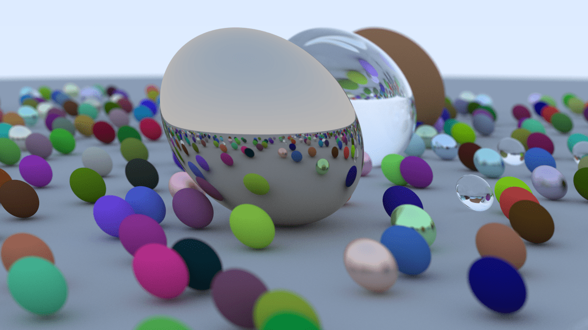

# raytracing-in-weekend
Repo for practicing raytracing, based on the book "Raytracing in a weekend"

## What is this project about?
This project is about learning the basics that is invovled with raytracing such as the maths and algorithims required to do so.

## How to build project
To build project, follow these steps:
1. Clone repo or download source code
2. Make sure cmake is installed
3. Once you have the repo downloaded onto desired file location input the following command: cmake -S . -B ./build
4. Project files should be built. If you are on windows, a visual studio solution will be built.
NOTE: Header Files will be loacted in external dependecies

## What to expect from project?
- Source Code of the project to show the alogrithims and math done
- Showcase a render of the spheres specficed in render section

# Final Render

